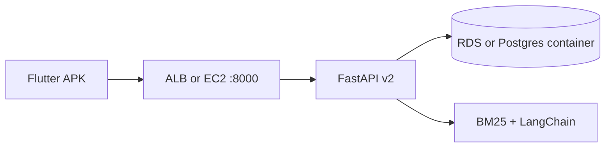

# AWS deployment — SME Advisor v2

Deploy the Docker stack (Postgres + FastAPI with RAG/LangChain) on **Amazon EC2** in `ap-southeast-1` (Malaysia-adjacent) or any region.

## Prerequisites

- AWS account, EC2 key pair, security group allowing **22**, **80**, **443**, **8000** (demo API)
- Domain optional (use Elastic IP + ngrok for APC demo)

## Quick start (EC2 + Docker Compose)

1. Launch **Ubuntu 22.04** `t3.small` (2 vCPU, 2 GB RAM minimum).
2. Attach an **Elastic IP** and open security group ports.
3. SSH in and install Docker:

```bash
sudo apt-get update && sudo apt-get install -y docker.io docker-compose-plugin git
sudo usermod -aG docker $USER
newgrp docker
```

4. Clone and configure:

```bash
git clone https://github.com/mizn08/SME-Advisor.git
cd SME-Advisor
cp .env.example .env
# Edit .env: strong POSTGRES_PASSWORD, APP_ENV=production
echo "APP_ENV=production" >> .env
```

5. Production compose (no pgAdmin):

```bash
docker compose -f docker-compose.yml -f deploy/aws/docker-compose.prod.yml up -d --build
curl http://localhost:8000/health
```

6. Public URL: point nginx/Caddy at port 8000, or for demos:

```bash
# On your laptop with ngrok
ngrok http <EC2_PUBLIC_IP>:8000
```

## Optional OpenAI (full LangChain agent + generative RAG)

On the server `.env`:

```env
OPENAI_API_KEY=sk-...
OPENAI_MODEL=gpt-4o-mini
```

Without a key, v2 still works: **BM25 retrieval** + template answers + rule-based multi-agent.

## Architecture



## Upgrade path

| Stage | Service |
|-------|---------|
| Demo | EC2 + Docker Compose (this guide) |
| Production | **RDS PostgreSQL** + **ECS Fargate** or **Elastic Beanstalk** |
| Secrets | **AWS Secrets Manager** for `OPENAI_API_KEY`, DB password |
| Static APK | **S3** + CloudFront |

## Cost tip

Stop the EC2 instance when not demoing; snapshot the EBS volume before major upgrades.
