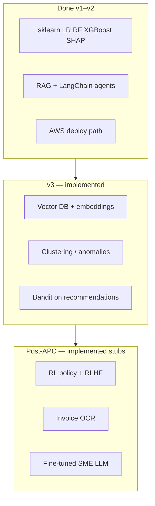

# SME Advisor — full AI roadmap (implemented)

| Layer | Status | Where |
|-------|--------|--------|
| ML ensemble | Done | `ml_pipeline/scripts/train_models.py` |
| Vector RAG | Done | `app/services/vector_rag_service.py` |
| BM25 fallback | Done | `app/services/rag_service.py` |
| KMeans + IsolationForest | Done | `app/services/unsupervised_service.py` |
| UCB bandit | Done | `app/services/bandit_service.py` |
| Q-learning + RLHF log | Done | `app/services/rl_policy_service.py` |
| Invoice OCR | Done | `app/services/ocr_service.py` + Tesseract in Docker |
| Fine-tune stub | Done | `ml_pipeline/scripts/finetune_sme_llm.py` |
| AWS | Done | `deploy/aws/` |
